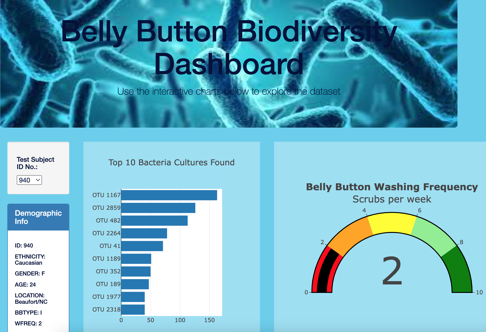

# Belly_Button_Biodiversity

# **Purpose**
A microbiology laboratory and Improbable Beef partnered to synthesize proteins from bacteria that taste like beef. They believe protein can be found in the belly button. A dataset containing anonymous people’s belly button bacteria was gathered and a panel for demographic information was created. Now the data needs to be visualized for each volunteer so that each individual’s top ten bacteria is easily recognizable.

## **Goal**
- Create a Horizontal Bar Chart
- Create a Bubble Chart
- Create a Gauge Chart
- Customize the Dashboard

## **Resources**
- Resources: data.js
- Software: Visual Studio Code, JavaScript, CSS, HTML, BootStrap, DevTools

## **Results**
The result was an interactive website that the teams at the microbiology lab and Improbable Beef can use to quickly identify information about the volunteers such as the type of bacteria they possess, the quantity of cultures, as well as bathing frequency.

First a horizontal bar chart was created to display the top 10 bacterial species (OTUs) that responds to the user selecting a Test Subject’s ID number. The horizontal bar chart displays the sample_values as the values, the otu_ids as the labels, and the otu_labels as the hover text for the bars on the chart.

Next, a bubble chart was created that displays the following when Test Subject’s ID is selected from the dropdown menu:
- The otu_ids as the x-axis values.
- The sample_values as the y-axis values.
- The sample_values as the marker size.
- The otu_ids as the marker colors.
- The otu_labels as the hover-text values.

A gauge chart was created that displays the weekly washing frequency and displays the value as a measure from 0-10.

Lastly, the page was customized. The following changes were made to the page to made it more visually appealing:
- A background image was added
- The title color was changed.
- A background color was applied to the website
- A section below the title was added to mention the purpose and functionality of the website.

See the images below as references:

